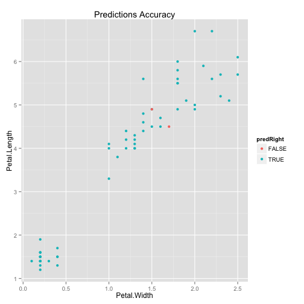

Devoping Data Product
========================================================
author: Wong Thai Min
date: 27th Dec 2015

Project Details
========================================================
A simple Shiny application has been developed to to analyse the impact of train/test data sets slicing and the number of decision trees parameters on the prediction accuracy of Random Forest algorithm.

In this applicatio, the user can manipulate the parameters with sliders and see the outcome differences at the output panel.

The application can be viewed at:
- Shiny server URL: http://tmwong.shinyapps.io/assignment
- GitHub repo URL: https://github.com/thaimin/DevelopDataProducts

About the dataset
========================================================
- The data used in this application is taken from the famous Edgar Anderson's Iris Data.
- Iris is a data frame with 150 cases (rows) and 5 variables (columns) named Sepal.Length, Sepal.Width, Petal.Length, Petal.Width, and Species.

```r
data(iris)
summary(iris)
```

```
  Sepal.Length    Sepal.Width     Petal.Length    Petal.Width   
 Min.   :4.300   Min.   :2.000   Min.   :1.000   Min.   :0.100  
 1st Qu.:5.100   1st Qu.:2.800   1st Qu.:1.600   1st Qu.:0.300  
 Median :5.800   Median :3.000   Median :4.350   Median :1.300  
 Mean   :5.843   Mean   :3.057   Mean   :3.758   Mean   :1.199  
 3rd Qu.:6.400   3rd Qu.:3.300   3rd Qu.:5.100   3rd Qu.:1.800  
 Max.   :7.900   Max.   :4.400   Max.   :6.900   Max.   :2.500  
       Species  
 setosa    :50  
 versicolor:50  
 virginica :50  
                
                
                
```

How it works
========================================================
- A Random Forest prediction model is used in this application.
- The train/test data sets partition ratio and the number of decision trees can be manipulated by the user.
- When user change the value of the parameters, the prediction accuracy will be calculated and the plot will be updated as well.


Sample Plot
========================================================
Sample plot of Prediction Accuracy:

 
